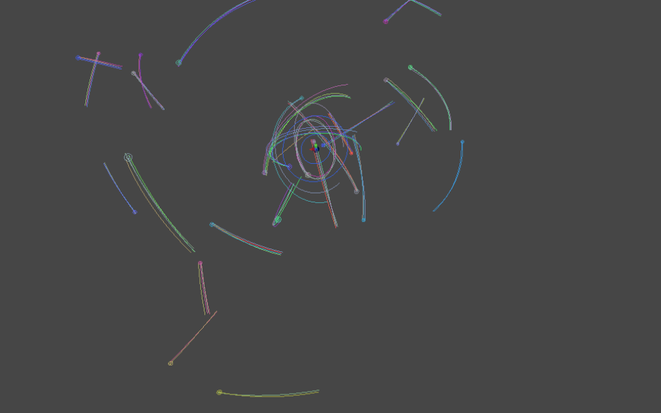
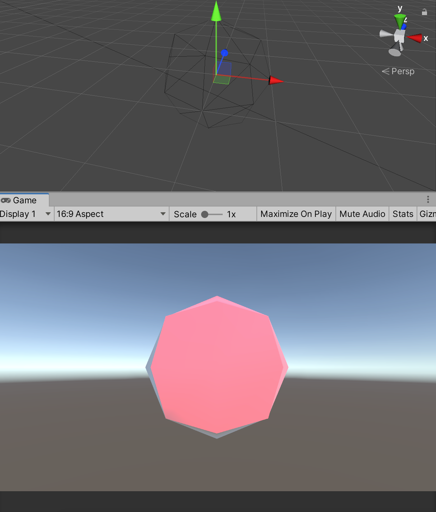
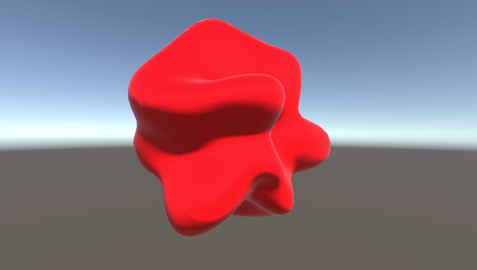
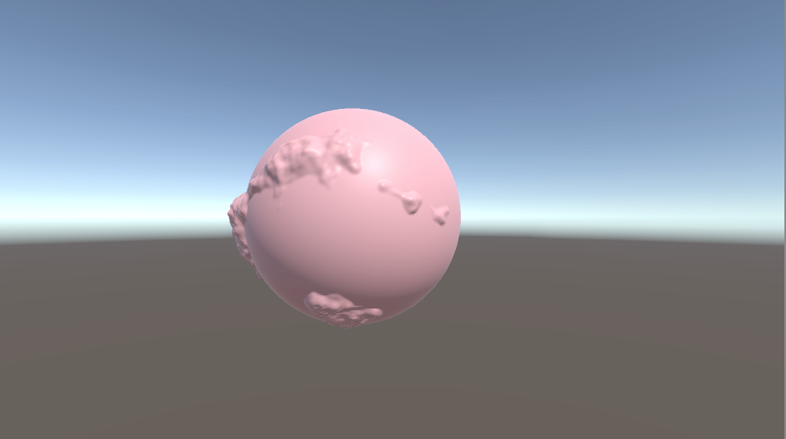
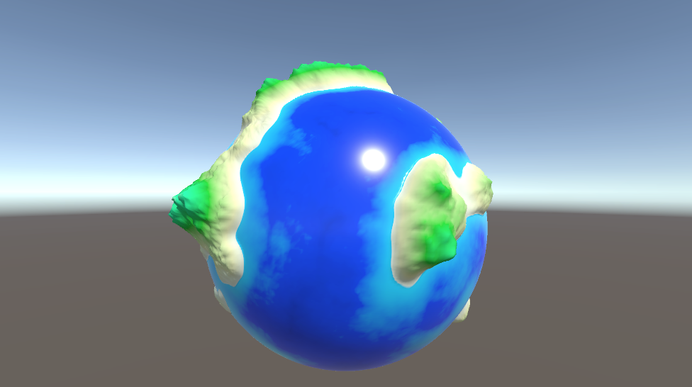
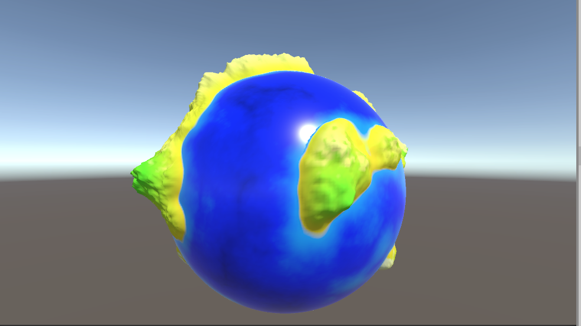
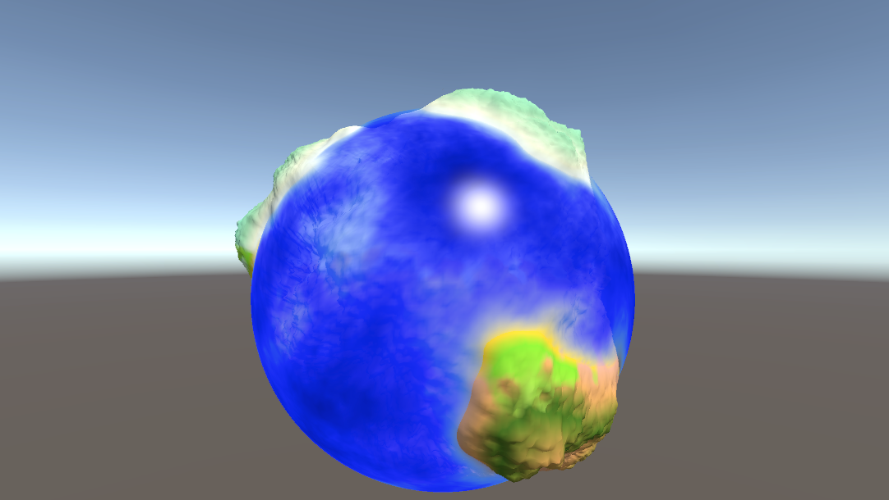
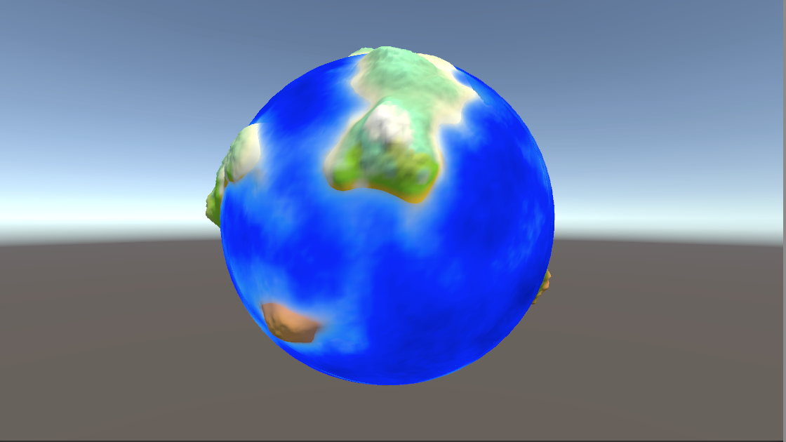
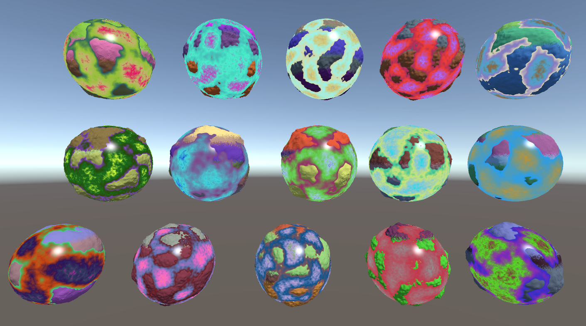

# Golaxy_PCG
 Unity2020.3.22f1
 
 URP 10.7.0
 
 Procedural content generation technology About Golaxy ,solar system,planet,moon ,ocean water ,mountain ,computer shader and so on
| Scene | Image | Description |
| --- | - | --- |
| `002SolarSystem` |  | 太阳系运动模拟-引力方程 |
| `002SolarSystem` | https://www.bilibili.com/video/BV145411U7u4/ | 登陆视频 |
| `S003-Shape` |  | 几何生成 |
| `S003-Shape` | https://www.bilibili.com/video/BV1S5411U7fN/ | 几何生成视频 |
| `S004-ShapeNoise` |  | 球面几何变化 |
| `S004-ShapeNoise` | https://www.bilibili.com/video/BV1jY411j7gj/ | 球面几何变化视频 |
| `S005-GPUShapeNoise` |  | ComputerShader处理生成球面 |
| `S005-GPUShapeNoise` | https://www.bilibili.com/video/BV13r4y1H7MV/ | ComputerShader处理生成球面视频 |
| `S006-Shader` |  | 球面着色 |
| `S006-Shader` | https://www.bilibili.com/video/BV1XY4y1e7KC/ | 球面着色视频 |
| `S007-GPUOceanShader` |  | ComputerShader球面着色 |
| `S007-GPUOceanShader` | https://www.bilibili.com/video/BV1U541127uS/ | ComputerShader球面着色视频 |
| `S010-UnlitOcean` |  | 海洋透明度 |
| `S010-UnlitOcean` | https://www.bilibili.com/video/BV1mT4y1h7TH/ | 海洋透明度视频 |
| `S011-UnlitOceanWave` |  | 海洋简单波浪 |
| `S011-UnlitOceanWave` | https://www.bilibili.com/video/BV1AZ4y1m7m3/ | 海洋简单波浪视频 |
| `S012-RadnomAndMultiplePass` |  | 添加行星随机生成，去掉海水独立的几何，改成另一个pass渲染 |
